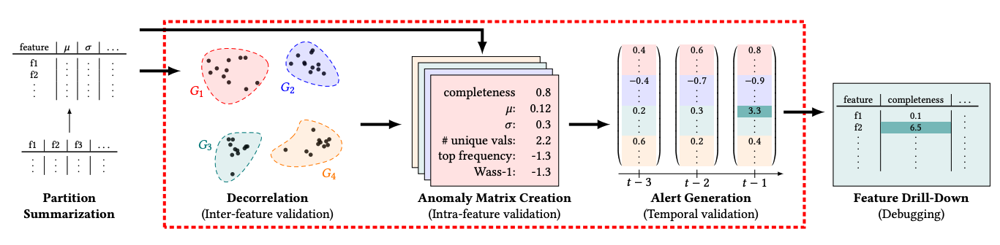

GATE is designed specifically for machine learning (ML) pipelines, where there may be many features and prediction columns. While other methods to detect drift may result in large numbers of false positives, GATE is designed to be more robust to this problem through the use of partition summaries.

## Partition Summarization

GATE ingests raw data and computes a _partition summary_ for each partition. A partition summary is a vector of statistical measures that captures the distribution of the data in the partition. Partitions are typically time-based; for example, one per day. The following statistics are computed for each column:

- coverage: The fraction of the column that has non-null values.
- mean: The mean of the column.
- stdev: The standard deviation of the column.
- num_unique_values: The number of unique values in the column.
- occurrence_ratio: The count of the most frequent value divided by the total count.
- p95: The 95th percentile of the column.

Partition summaries are small, and can be computed quickly. They are also robust to outliers, which is important for ML pipelines where there may be many features and prediction columns.

## Drift Detection

The partition summaries are then fed into an anomaly detection algorithm to detect whether a new partition is anomalous.

### Clustering

Since many columns might be correlated, GATE first clusters the columns into groups. GATE considers both the semantic meaning of the column (e.g., "age" and "income") and the partition summaries.

Clustering is automatically performed by the GATE algorithm. The user does not need to specify the number of clusters. Partition summaries are normalized via z-score before clustering, so that the clustering algorithm is not biased towards columns with larger values.

!!! note

    Clustering is engaged if there are more than 10 columns. If there are fewer than 10 columns, no clustering is performed.

### Nearest Neighbor Algorithm

Normalized partition summaries are then fed into a nearest neighbor algorithm to detect whether a new partition is anomalous. The nearest neighbor algorithm is a variant of the [k-nearest neighbors](https://en.wikipedia.org/wiki/K-nearest_neighbors_algorithm) algorithm. The algorithm computes the distance between the new partition and the nearest neighbors in previous partition summaries. If the distance is large (i.e., in the 90th percentile of distances), the new partition is considered drifted.

!!! note
    If clustering is engaged, column summaries are averaged within each cluster before computing distances. This essentially reduces the dimensionality of the partition summary.

## Drill Down

If a partition is detected as drifted, GATE can be used to drill down into the partition to identify the specific columns that are drifted. The columns with the largest z-score values are returned.

## Differences from the original research paper

Differences from the original implementation include:

- Removal of the need to specify a window size to normalize statistics over.
- Removal of the Wasserstein-1 distance and num_frequent_values metrics, which are time-consuming to compute and not as useful as other metrics.
- Addition of the p95 metric.
- Embeddings of column names and types in the clustering algorithm (in addition to partition summaries).